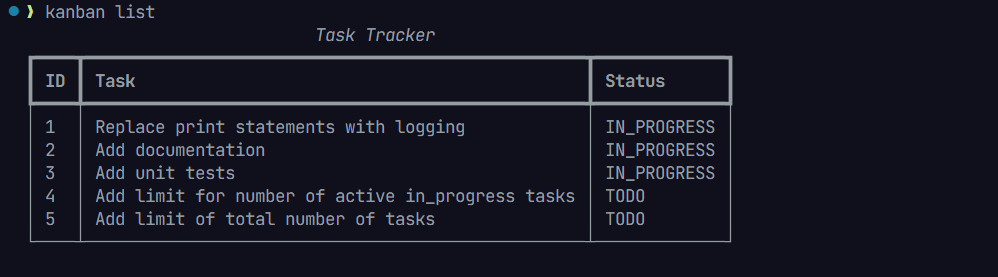

# personal-kanban-task-tracker
- Personal cli tool to track tasks and manage your to-do list.
- Inspired by Toyota executive Taiichi Ohno (1912–90)

- Two basic rules:
    - Be transparent to yourself (and others), whhat you’re planning to do, what you’re doing right now, what you’ve already done.
    - Parcel big tasks into smaller more manageable subtasks right away. (Plan less, do more.)

- For each task track three states labeled:
	- `‘To do’`.
	- `‘Doing’`.
	- `‘Done’`.

- Briefly ask yourself, about each subtask: 
	- how long will it take? 
	- Can I do it myself?
	- do I need help? 
	- Is it more urgent than any of the others?

- The app helps you visualize the workflow, so as soon as you have started working on a task, mark it as ‘Doing/in-progress’.
- When the task is complete, mark it as ‘Done’.
- Now you’re on a roll. You have switched from planning to doing!

- OneMoreRule!:
    - You’re only allowed a limited number of active in-progress tasks - ‘work in progress (WIP) limit’. 
    - It’s especially important that you keep your WIP limit for the ‘Doing/in-progress’ column to a minimum, perhaps no more than three tasks.
    - This helps focus all resources on completing the task in hand, rather than remembering all the open ones.
	- A small number of finished subtasks is more useful than lots of half-done ones.

---

## Requirements:
The application should run from the command line, accept user actions and inputs as arguments, and store the tasks. The user should be able to:
- Add, Update, and Delete tasks

- Mark a task as in progress or done

- List all tasks

- List all tasks that are done

- List all tasks that are not done

- List all tasks that are in progress

### non functional additional features
- list tasks by priority.
- list overdue tasks.
- list by category daily, weekly, monthly.

---

## Features:
- Add task - create new task.
```
todo add "Buy groceries"
```
- Update task - make changes to an existing task description.
```
todo update 1 "Buy groceries and cook dinner"
```
- Delete task - delete an existing task.
```
todo delete 1
```
- Mark task - set task status property as in progress or done.
```
todo mark-in-progress 1
todo mark-done 1
```
- List tasks - list all tasks.
```
todo list
```
- List done - list all tasks with status set to done.
- List to-do - list all tasks with status set to to-do.
- List in-progress - list all tasks with status set to in-progress.

```
todo list done
todo list todo
todo list in-progress
```

---

## Example


```bash
# Adding a new task
todo add "Buy groceries"
# Output: Task added successfully (ID: 1)

# Updating and deleting tasks
todo update 1 "Buy groceries and cook dinner"
todo delete 1
# Output: Task deleted successfully (1. "Buy groceries and cook dinner")

# Marking a task as in progress or done
todo mark-in-progress 1
todo mark-done 1

# Listing all tasks
todo list

# Listing tasks by status
todo list done
todo list todo
todo list in-progress

```
---

## Core Entities and Relationships
- track ownership boundaries of core entities clarified in requiremets.

- What must the system do:


| Requirement       | Primary Entity | Use case        |
| ----------------- | -------------- | --------------- |
| Accept user input | None           | Receive Command |
| Parse Arguments   | None           | Parse Arguments |
| User creates task | task           | CreateTask      |
| User lists tasks  | task           | ListTasks       |
| User update task  | task           | UpdateTask      |
| user delete task  | task           | DeleteTask      |


- System components and seperation of concerns


| Component/Class | Type       | Single Responsibility             | State                       | Depends On           |
| --------------- | ---------- | --------------------------------- | --------------------------- | -------------------- |
| CLI             | boundary   | Receive input/output              | None                        | ArgumentParser       |
| ArgumentParser  | Utility    | Parse CLI commands                | None                        | TaskManager          |
| TaskManager     | Service    | Coordinate task use cases         | TaskRepository              | Task, TaskRepository |
| Task            | Entity     | Represent Task domain object      | id, title, status, due-date | None                 |
| TaskRepository  | Repository | Persist(store) and retrieve tasks | Database Connection         | Database             |


## Class Design:
```
CLI
 |
 |
 ArgumentParser
 |
 |
 TaskManager
 |
 |
 + - - - - - - - -+
 |                |
 |                |
 Task             TaskRepository
                  |
                  |
                  DataBase
```

---

## CLI flow

```
user types command
       |
       |
CLI parses command
       |
       |
TaskManager.add_task(...)
       |
       |
Repository.add(task)
       |
       |
CLI stdout ( task added successfully! else Error )

```
---
